# SLAPulse

**Uptime monitoring your customers can audit — and evidence for why it happened when something breaks.**

SLAPulse is two products in one platform: a real, multi-region uptime
monitor (the thing your SREs actually watch) that feeds a tamper-evident,
customer-facing Trust Portal (the thing your CSMs stop fighting about in
renewal calls).

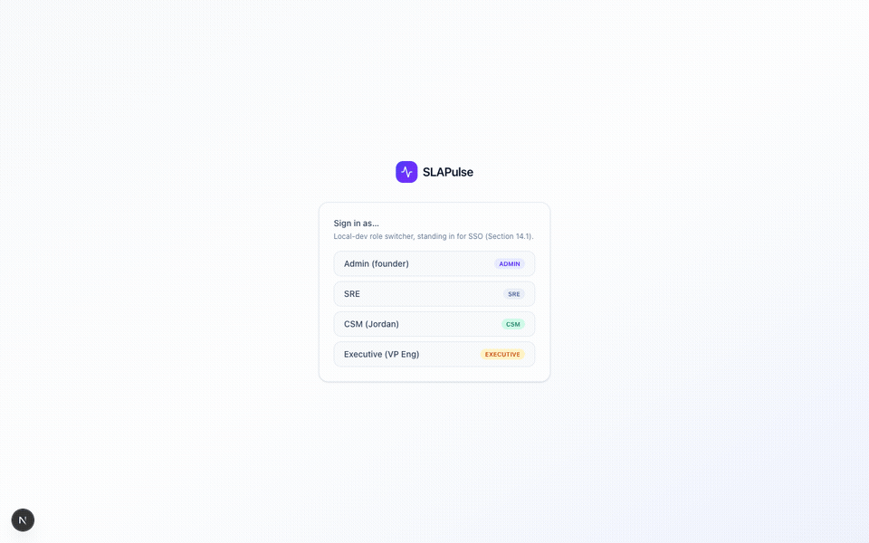

---

## The problem this solves

Every SaaS company with an SLA in its contract eventually has the same
argument with a customer: *"you said 99.9%, prove it."* Today that proof
lives in someone's CloudWatch dashboard, a support engineer's memory, and
a spreadsheet someone updates before renewal season. That's slow, it's
disputable, and it costs deals.

SLAPulse fixes this by making uptime evidence a **product feature**, not
a manual process:

- Uptime is measured **independently of your own infrastructure**, from
  outside it — the same trust model as UptimeRobot or Pingdom, so a
  customer can't accuse you of grading your own homework.
- Every compliance number that ever gets shown to a customer is written
  once, to a **hash-chained, append-only log**, and never edited — if
  a number is wrong, you issue a correction with a visible trail, you
  don't quietly change history.
- Customers get **their own login** to see it — live status, monthly
  history, incident disclosures, and a downloadable audit package —
  instead of asking your team for a screenshot.

## Two products, one platform

| | **Uptime Monitoring** *(primary)* | **AWS Evidence** *(add-on)* |
|---|---|---|
| What it answers | "Is it up right now, and what's our real uptime %?" | "*Why* did it go down — was it us or a dependency?" |
| How it measures | Real HTTPS/TCP/keyword/heartbeat checks from multiple regions, quorum-confirmed (no single flaky probe triggers an incident) | Correlated Route53 + ALB + ECS signals plus synthetic transaction checks |
| Setup cost | Add a URL, pick regions and an interval — zero AWS access required | Requires a scoped cross-account role into the customer's AWS |
| Who it's for | Any company that needs to prove uptime to anyone | Companies that also want root-cause evidence for the postmortem |

The two link together per customer — from a monitor's detail page you
jump straight to the AWS evidence explaining *why* an incident happened,
without leaving the product.

---

## Walkthrough

### 1. Sign in
A role-based entry point (Admin, SRE, CSM, Executive) — in production this
is your real SSO/OIDC provider; every screen below respects the signed-in
role's permissions.

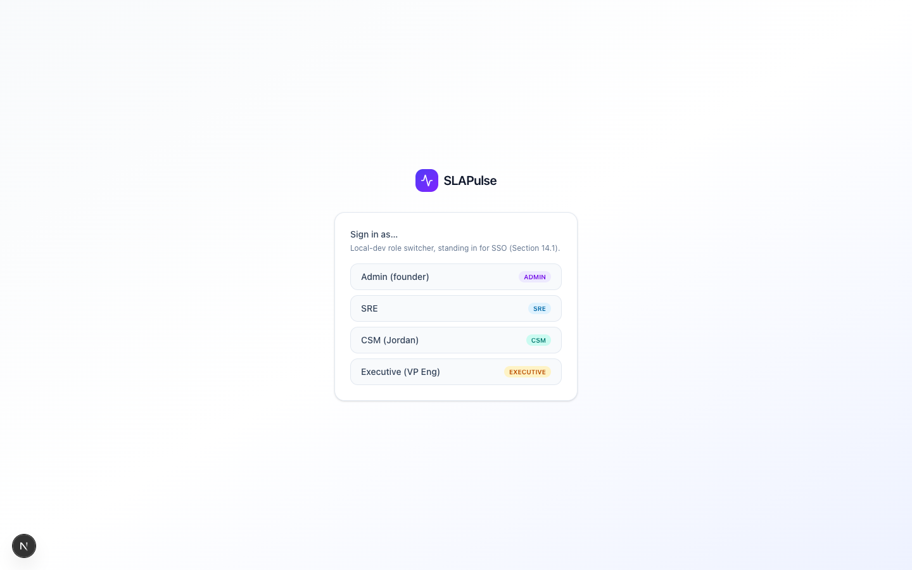

### 2. Uptime Monitoring — the primary product
Every monitored URL, its live status, response time, and this-month
uptime, at a glance. Add a new monitor with a check type (HTTPS, TCP
port, keyword match, or heartbeat/cron ping), regions to check from, and
an interval — no AWS account, no agent to install.

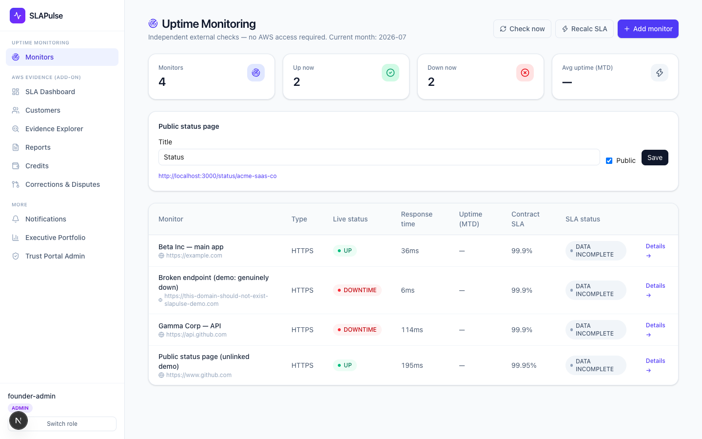

### 3. Real failures, not staged ones
This isn't a mockup with fake "down" badges — the check underneath is a
real network call. Below, an intentionally-broken demo endpoint is
independently confirmed down from every configured region, with a real
incident timeline building underneath it.

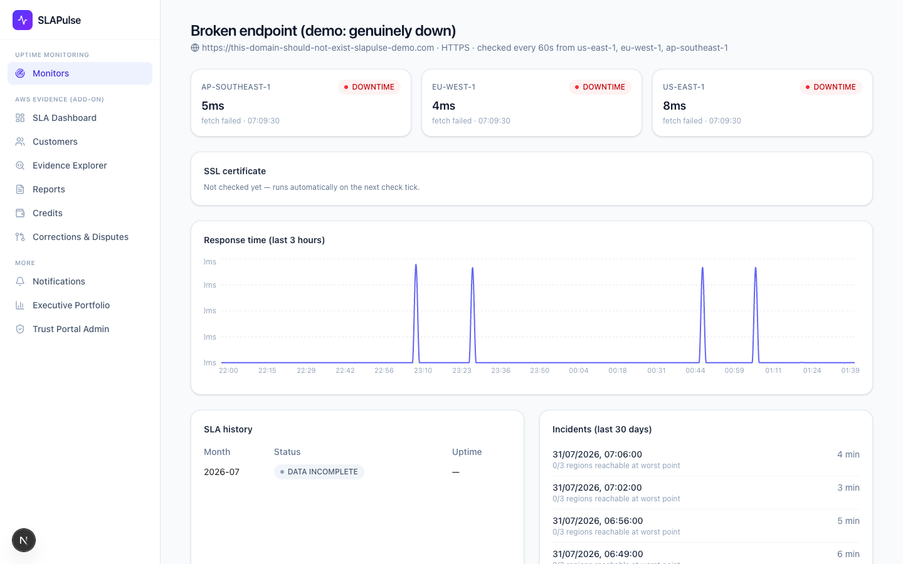

### 4. SSL, response time, and the bridge to root-cause evidence
Real TLS certificate inspection (issuer, expiry countdown), a live
response-time trace, and — when this monitor is linked to a customer
account — a direct jump into the AWS Evidence side to see *why* an
incident happened.

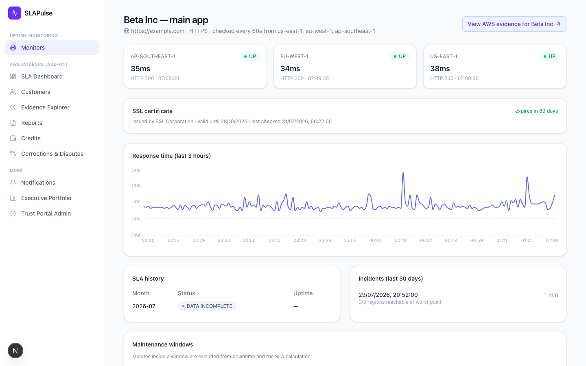

### 5. AWS Evidence — root cause, not just a red dot
Correlated infrastructure signals (Route53, ALB 5xx rate, ECS task
health) explain the "why" behind a status change, all written to a
second, independently hash-chained audit log.

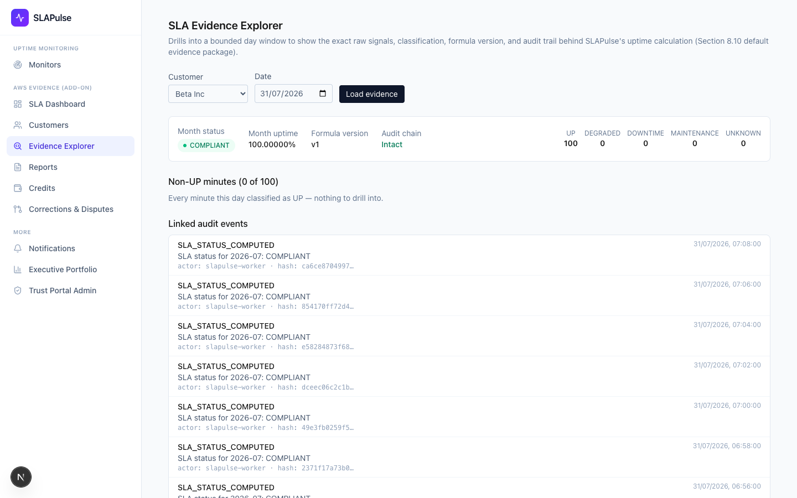

### 6. Internal dashboard
The at-a-glance operational view for SREs and support: portfolio health,
trend over the last 3/6/12 months, and every account's current status.

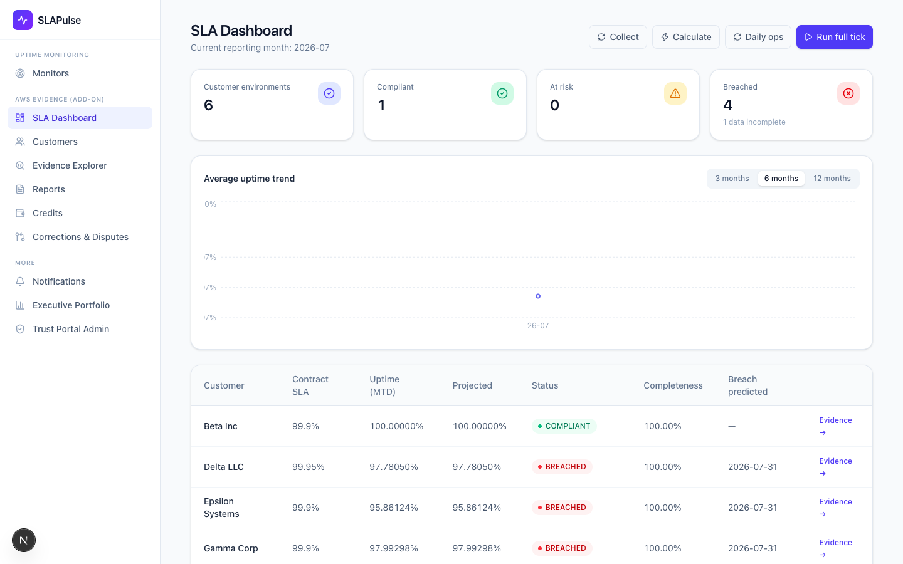

### 7. Executive portfolio view
The board-pack rollup — compliant vs. at-risk vs. breached across the
entire customer base, with trend — for the people who need the 30-second
version, not the incident log.

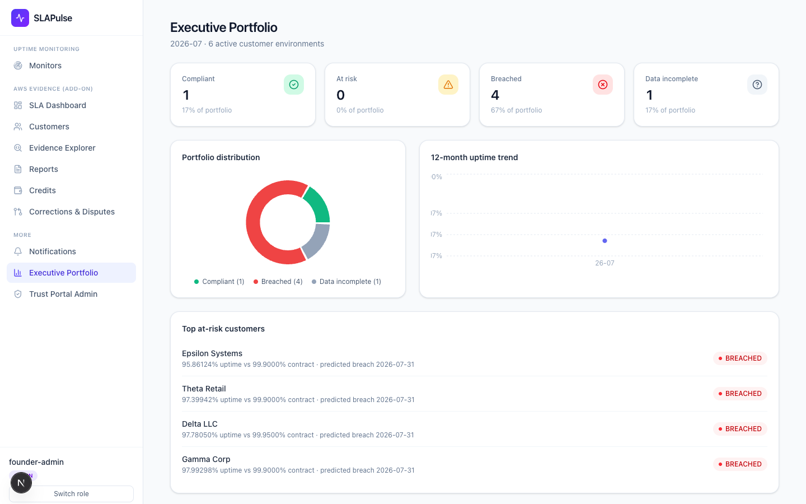

### 8–9. The Trust Portal — your customer's own view
Customers sign in with a one-time link (no shared passwords) to a
completely separate, white-labelable surface with none of your internal
tooling visible. They see their current status, full compliance history,
incident disclosures, can flag a dispute themselves, download a formal
audit export package, and even generate a read-only API key to pull their
own uptime number programmatically.

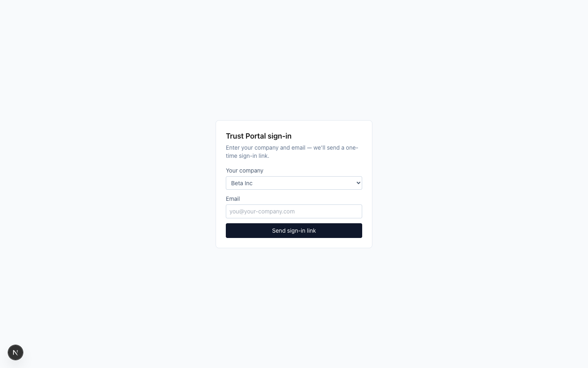
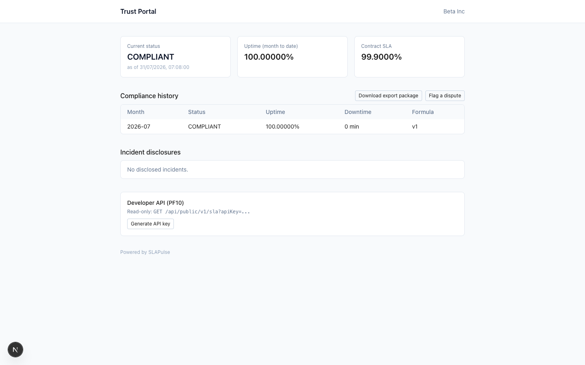

### 10. Public status page
No login required — the page you link from your marketing site or put in
your status.your-domain.com CNAME.

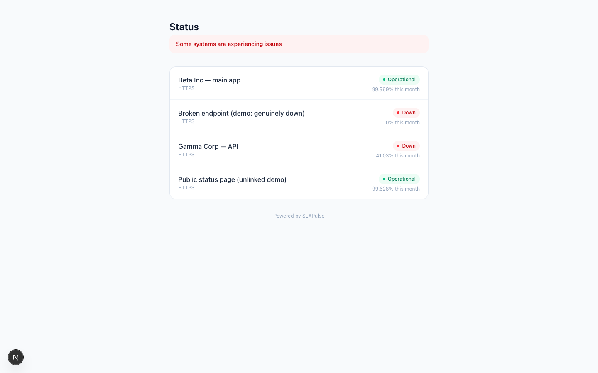

---

## Why this matters, in business terms

- **Fewer support escalations about uptime.** Customers self-serve the
  answer instead of opening a ticket and waiting on an engineer.
- **Faster, less adversarial renewals.** The compliance history and
  audit export exist before the renewal conversation starts, not
  assembled under deadline pressure.
- **Credibility with technical buyers.** SRE/DevOps evaluators recognize
  the same primitives they already trust — multi-region quorum checks,
  independent external monitoring, real SSL inspection, heartbeat/dead-
  man's-switch monitoring for cron jobs — this isn't a toy status page.
- **Defensible in a dispute.** A hash-chained, append-only log means "we
  changed the SLA math after the fact" isn't possible without leaving a
  visible correction trail — which matters the day a customer's legal
  team asks for evidence.

## Feature coverage

**Uptime Monitoring** — HTTPS / TCP port / keyword-match / heartbeat
(cron dead-man's-switch) checks · configurable regions and check
interval · N-of-M quorum confirmation to avoid single-probe false
positives · real TLS certificate monitoring with expiry warnings ·
maintenance windows (checks pause, SLA math excludes the window) ·
webhook alerting with a configurable confirmation threshold · public,
shareable status pages · computed incident timelines · fail-closed SLA
math (never guesses compliant when data is incomplete).

**AWS Evidence (add-on)** — correlated infrastructure signal detection
(Route53 + ALB + ECS) · synthetic transaction monitoring for the
"infra is green but the app is broken" blind spot · incident-to-downtime
attribution · breach prediction · SLA credit automation · multi-tier SLA
support · simulated cross-account deployment model.

**Trust & audit** — two independent hash-chained append-only audit logs
· two-approver correction workflow (no silent edits) · formal export
package (PF11) · third-party attestation display · disclosure-delay
handling for sensitive incidents.

**Trust Portal** — white-label shell · magic-link auth (no shared
passwords) · live status + full history · customer-initiated dispute
flagging · multi-environment rollup · read-only API key for programmatic
access · renewal-risk banner.

**Platform** — row-level-security-enforced multi-tenancy (a customer's
data is unreachable by another tenant at the database layer, not just in
application code) · role-based access (Admin / SRE / CSM / Executive).

---

## Roles

- **Admin** — full access: register customers/monitors, trigger jobs, issue credits, configure the Portal.
- **SRE** — sees everything, can trigger jobs and corrections, cannot register customers or issue credits.
- **CSM** — sees only its assigned accounts, no write access to SLA data.
- **Executive** — portfolio-only view, no per-customer evidence drill-down.

---

## Running it locally

This is a local-dev build: the calculation core (downtime detection,
fail-closed completeness gating, hash-chained audit logs, real network
checks) is real. A handful of things that would otherwise require a live
AWS account, SSO provider, or paging/email service are substituted —
see [Local-dev substitutions](#local-dev-substitutions) below.

### Prerequisites
Node 20+, Docker Desktop. No AWS account needed. Puppeteer downloads its own headless Chromium on `npm install`.

### First-time setup

```bash
cp .env.example .env
npm install
npm run db:up       # Postgres in Docker on localhost:5434
npm run migrate     # full schema: RLS, hash chains, monitors, portal tables
npm run seed        # one vendor + 6 customers + 4 uptime monitors, pre-populated
```

### Run it

Two processes, two terminals:

```bash
npm run dev      # Next.js app on http://localhost:3000
npm run worker   # background jobs: uptime checks/30s, SLA calc/2min, daily ops/3min
```

Open http://localhost:3000, sign in as **Admin** first, and watch data
fill in as the worker's first tick lands (or trigger any job on demand
from the dashboard).

Seeded customers cover every SLA outcome:

| Customer | Profile | Demonstrates |
|---|---|---|
| Beta Inc | stable | COMPLIANT, near-100% uptime |
| Gamma Corp | flaky | AT_RISK / occasional downtime, credit memo automation |
| Delta LLC | degrading | Cross-account log, drift detection |
| Epsilon Systems | breached | BREACHED, daily outage window, credit memo, short disclosure ceiling |
| Zeta Health | data gap | DATA_INCOMPLETE — the fail-closed completeness gate |
| Theta Retail | app outage | Synthetic monitoring catches an outage infra signals miss |

Seeded uptime monitors: a stable app, a real flaky third-party API, a
deliberately nonexistent domain (to show a genuine DNS-failure incident),
and an unlinked public status-page demo.

### Regenerating the screenshots / demo GIF

```bash
npx tsx scripts/capture-demo.ts             # docs/screenshots/*.png
ffmpeg -y -framerate 1/2.2 -pattern_type glob -i 'docs/screenshots/*.png' \
  -vf "scale=960:-1:flags=lanczos,fps=10,split[s0][s1];[s0]palettegen=stats_mode=diff[p];[s1][p]paletteuse=dither=bayer" \
  docs/screenshots/demo.gif
```

### Verifying tenant isolation

```bash
docker exec slapulse-postgres psql -U slapulse -d slapulse -c \
  "select tablename, policyname from pg_policies order by tablename;"
```

Every tenant table should show a `tenant_isolation` policy. The app
connects as `slapulse_app`, not the Postgres superuser, and every table
is under `FORCE ROW LEVEL SECURITY` — `src/lib/db.ts`'s `withTenant()`
sets `app.current_vendor_id` per-transaction. The narrow exceptions
(magic-link token lookup, API key lookup, heartbeat ping lookup) go
through `SECURITY DEFINER` Postgres functions rather than bypassing RLS
in application code.

### Resetting local data

```bash
npm run db:down -- -v
npm run db:up
npm run migrate
npm run seed
```

### Local-dev substitutions

Everything in the calculation core is real. Four things are substituted
because there's no AWS account, SSO provider, or email/paging service to
point this at locally — swapping any one for the real thing does not
touch the calculation core:

| Spec calls for | This build uses | Where |
|---|---|---|
| CloudWatch/Route53/ECS APIs (+ synthetic transaction checks) | Deterministic mock signal generator, seeded per customer/minute | `src/lib/mockCollector.ts` |
| EventBridge + SQS + Lambda fan-out, cross-account STS AssumeRole | A single Node process (`node-cron`) calling the same job functions in-process, plus a simulated role-assumption log | `src/worker.ts`, `src/jobs/*` |
| Cognito/Clerk OIDC/SSO (staff) + real Portal SSO/magic-link email (customers) | A cookie-based staff role switcher, and a real magic-link flow whose "email" writes to a local outbox instead of sending | `src/lib/auth.ts`, `src/lib/portalAuth.ts` |
| Slack + PagerDuty, SES | A `notifications` table (`/notifications`) and a local mail outbox | `src/lib/reportStorage.ts` |
| S3 Object Lock + external transparency log | A local append-only anchor file + `audit_chain_anchors` table | `src/lib/auditAnchor.ts` |

External uptime checks (HTTPS/TCP/keyword/SSL/heartbeat) are **not** on
this list — those are real network calls with no mocking, by design.

### Known local-dev-only rough edges

- ESLint's newer React-Compiler-oriented rules flag the fetch-on-mount
  `useEffect` pattern used across the dashboard pages. Functionally
  correct (verified via browser testing), not refactored here to avoid
  a sweeping, low-value change across ~10 pages.
- The Portal login page's "which company" picker is a local-dev
  simplification of the real mechanism (a distinct link/subdomain per
  customer).
