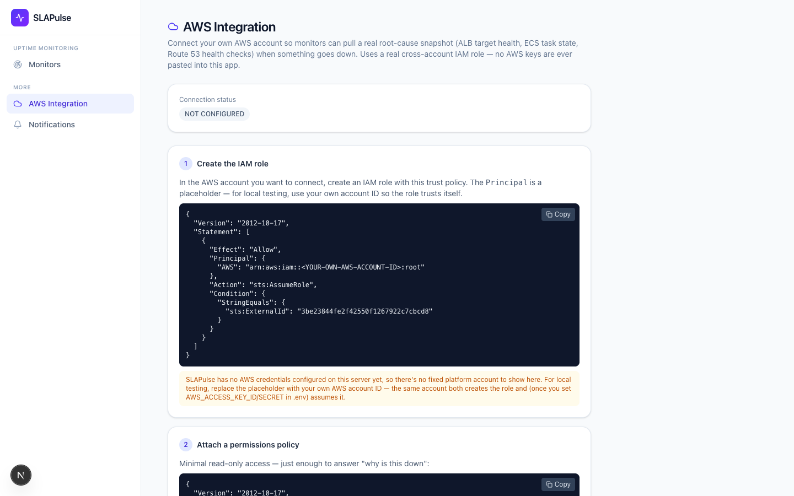
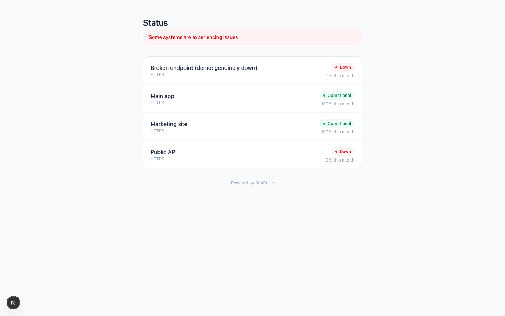

# SLAPulse

**Real, independent uptime monitoring for your endpoints — plus a real cross-account AWS connection to explain why one went down.**

One company, one login, N monitored endpoints. No nested "customer" accounts, no reseller SLA bookkeeping — just the thing an SRE, DevOps, or platform engineer actually wants: is it up, from outside our own infrastructure, and if it's down, what does our own AWS account say about why.


---

## The problem this solves

Uptime tools like UptimeRobot or Pingdom tell you *that* something is down. They can't tell you *why* — that requires access to your own infrastructure, which they don't have and shouldn't. SLAPulse does both in one product:

- **Independent external monitoring** — the same trust model as any third-party uptime checker: checks run from outside your infrastructure, so a false-green from your own monitoring stack can't hide an outage.
- **A real, optional AWS connection** — a genuine cross-account IAM role (`sts:AssumeRole`, external ID, scoped read-only permissions), not a mocked integration. Once connected, tag a monitor with the AWS resources behind it (ALB target group, ECS service, Route 53 health check) and pull a live, on-demand root-cause snapshot when something's down.
- **Fail-closed SLA math** — the monthly uptime number never guesses COMPLIANT when data is incomplete; it says so, explicitly, and a hash-chained audit log means nobody can quietly edit the history.

## Walkthrough

### 1. Sign in
A role-based entry point (Admin, SRE, CSM, Executive) — in production this is your real SSO/OIDC provider.


### 2. Monitors — add an endpoint, watch it
Every monitored URL, its live status, response time, and this-month uptime, at a glance. Add a monitor with a check type (HTTPS, TCP port, keyword match, or heartbeat/cron ping), regions to check from, and an interval — no AWS account required to get started.


### 3. Real failures, not staged ones
This isn't a mockup with fake "down" badges — the check underneath is a real network call. Below, an intentionally-broken demo endpoint is independently confirmed down from every configured region, with a real incident timeline building underneath it.


### 4. SSL, response time, and (once connected) root cause
Real TLS certificate inspection (issuer, expiry countdown), a live response-time trace, and — when this endpoint is tagged with AWS resources and the account is connected — an on-demand "Check now" that pulls real ALB target health, ECS task state, and Route 53 health-check status.


### 5. AWS Integration — a real cross-account connection, not a mock
Step-by-step setup: the exact trust-policy JSON (with a generated external ID), the minimal read-only permissions policy, a role ARN + region field, and a "Test connection" button that performs a genuine `sts:AssumeRole` call — not a simulated log entry. If AWS isn't configured on the server, it says so plainly instead of faking success.



### 6. Public status page
No login required — the page you link from your marketing site or put behind a status.your-domain.com CNAME.



---

## Why this matters, in business terms

- **Independent proof, not self-reported uptime.** Checks run from outside your infrastructure — the same credibility model SRE/DevOps evaluators already trust from UptimeRobot/Pingdom-class tools.
- **A real integration story, not a demo-ware mock.** The AWS connection is an actual cross-account IAM role with a real `AssumeRole` call — the kind of mechanism a technical buyer's security review will actually ask about, and it holds up.
- **No account-model tax.** One company, one login, N endpoints — nothing to reconcile against a "customers" list that doesn't map to how the product is actually used.
- **Defensible math.** Fail-closed SLA calculation and a hash-chained, append-only audit log mean the uptime number shown today can't have been quietly rewritten.

## Feature coverage

**Uptime Monitoring** — HTTPS / TCP port / keyword-match / heartbeat (cron dead-man's-switch) checks · configurable regions and check interval · N-of-M quorum confirmation to avoid single-probe false positives · real TLS certificate monitoring with expiry warnings · maintenance windows (checks pause, SLA math excludes the window) · webhook alerting with a configurable confirmation threshold · public, shareable status pages · computed incident timelines · fail-closed SLA math (never guesses compliant when data is incomplete) · hash-chained, append-only audit log.

**AWS Integration** — real cross-account `sts:AssumeRole` connection (external-ID trust condition, minimal read-only permissions policy) · per-monitor AWS resource tagging (ALB target group, ECS cluster/service, Route 53 health check) · on-demand root-cause snapshot reusing the same infra-downtime classifier as the core detection logic · graceful "not configured" / "not connected" states — never a faked result.

**Platform** — row-level-security-enforced multi-tenancy (one vendor's data is unreachable by another at the database layer, not just in application code) · role-based access (Admin / SRE / CSM / Executive).

---

## Roles

- **Admin** — full access: manage monitors, configure the AWS connection.
- **SRE** — same operational access as Admin (manage monitors, AWS connection).
- **CSM** — read-only.
- **Executive** — read-only.

---

## Running it locally

This is a local-dev build: the calculation core (downtime detection, fail-closed completeness gating, hash-chained audit log, real network checks, and the real AWS `AssumeRole` connection) is genuinely real. A couple of things that would otherwise require a live SSO provider or paging/email service are substituted — see [Local-dev substitutions](#local-dev-substitutions) below.

### Prerequisites
Node 20+, Docker Desktop. Puppeteer downloads its own headless Chromium on `npm install`. An AWS account is optional — only needed if you want to test the real AWS Integration wizard end-to-end.

### First-time setup

```bash
cp .env.example .env
npm install
npm run db:up       # Postgres in Docker on localhost:5434
npm run migrate     # full schema: RLS, hash chains, monitors, AWS connection
npm run seed        # one vendor + 4 uptime monitors, pre-populated
```

### Run it

Two processes, two terminals:

```bash
npm run dev      # Next.js app on http://localhost:3000
npm run worker   # background jobs: uptime checks/30s, SLA calc/2min
```

Open http://localhost:3000, sign in as **Admin**, and watch data fill in as the worker's first tick lands (or trigger a check/recalc on demand from the Monitors page).

Seeded monitors: a stable app, a real flaky third-party API, a deliberately nonexistent domain (to show a genuine DNS-failure incident from the very first check), and an unlinked public-status-page demo.

### Testing the real AWS Integration wizard end-to-end

This needs a real AWS sandbox account — SLAPulse can't create one for you:

1. Set `AWS_ACCESS_KEY_ID` / `AWS_SECRET_ACCESS_KEY` / `AWS_REGION` in `.env` (or run `aws configure` / SSO login) for the identity that will act as "platform."
2. In that same account (self-trust, for local testing), create an IAM role whose trust policy's `Principal` is that account and whose `Condition.StringEquals.sts:ExternalId` matches the value shown at `/aws-integration`, with a permissions policy granting `elasticloadbalancing:DescribeTargetHealth`, `ecs:DescribeServices`, `ecs:ListServices`, `route53:GetHealthCheckStatus` on `Resource: "*"`.
3. Enter the role ARN + region in the wizard, click **Test connection** — status should flip to `CONNECTED` with the real account ID shown.
4. Tag a monitor with a real Route 53 health check ID (cheapest resource to spin up for a smoke test) and use the monitor detail page's "Check now" to pull a live snapshot.

### Regenerating the screenshots / demo GIF

```bash
npx tsx scripts/capture-demo.ts             # docs/screenshots/*.png
ffmpeg -y -framerate 1/2.2 -pattern_type glob -i 'docs/screenshots/*.png' \
  -vf "scale=960:-1:flags=lanczos,fps=10,split[s0][s1];[s0]palettegen=stats_mode=diff[p];[s1][p]paletteuse=dither=bayer" \
  docs/screenshots/demo.gif
```

### Verifying tenant isolation

```bash
docker exec slapulse-postgres psql -U slapulse -d slapulse -c \
  "select tablename, policyname from pg_policies order by tablename;"
```

Every tenant table should show a `tenant_isolation` policy. The app connects as `slapulse_app`, not the Postgres superuser, and every table is under `FORCE ROW LEVEL SECURITY` — `src/lib/db.ts`'s `withTenant()` sets `app.current_vendor_id` per-transaction.

### Resetting local data

```bash
npm run db:down -- -v
npm run db:up
npm run migrate
npm run seed
```

### Local-dev substitutions

The calculation core, real network checks, and the real AWS cross-account connection are not mocked. Two things are substituted because there's no live SSO provider or paging/email service to point this at locally:

| Spec calls for | This build uses | Where |
|---|---|---|
| Cognito/Clerk OIDC/SSO | A cookie-based role switcher | `src/lib/auth.ts` |
| Slack + PagerDuty | A `notifications` table (`/notifications`) | `src/jobs/uptimeChecker.ts` |

External uptime checks (HTTPS/TCP/keyword/SSL/heartbeat) and the AWS `AssumeRole` connection are **not** on this list — those are real, by design.

### Known local-dev-only rough edges

- ESLint's newer React-Compiler-oriented rules flag the fetch-on-mount `useEffect` pattern used across the pages, and a couple of `Date.now()` calls in render (SSL expiry countdown, heartbeat staleness check). Functionally correct (verified via browser testing), not refactored here to avoid a sweeping, low-value change.
- The AWS Integration wizard's trust-policy `Principal` needs a fixed, SLAPulse-owned AWS account ID in production; locally it falls back to a self-trust placeholder since there's no deployed platform account yet.
